# MeetGo Platform - Flow Diagrams

## 📊 Complete User Journey Flow Diagrams

This document contains visual flow diagrams showing the complete user journeys and system interactions in the MeetGo platform.

---

## 🔄 1. Overall System Architecture Flow

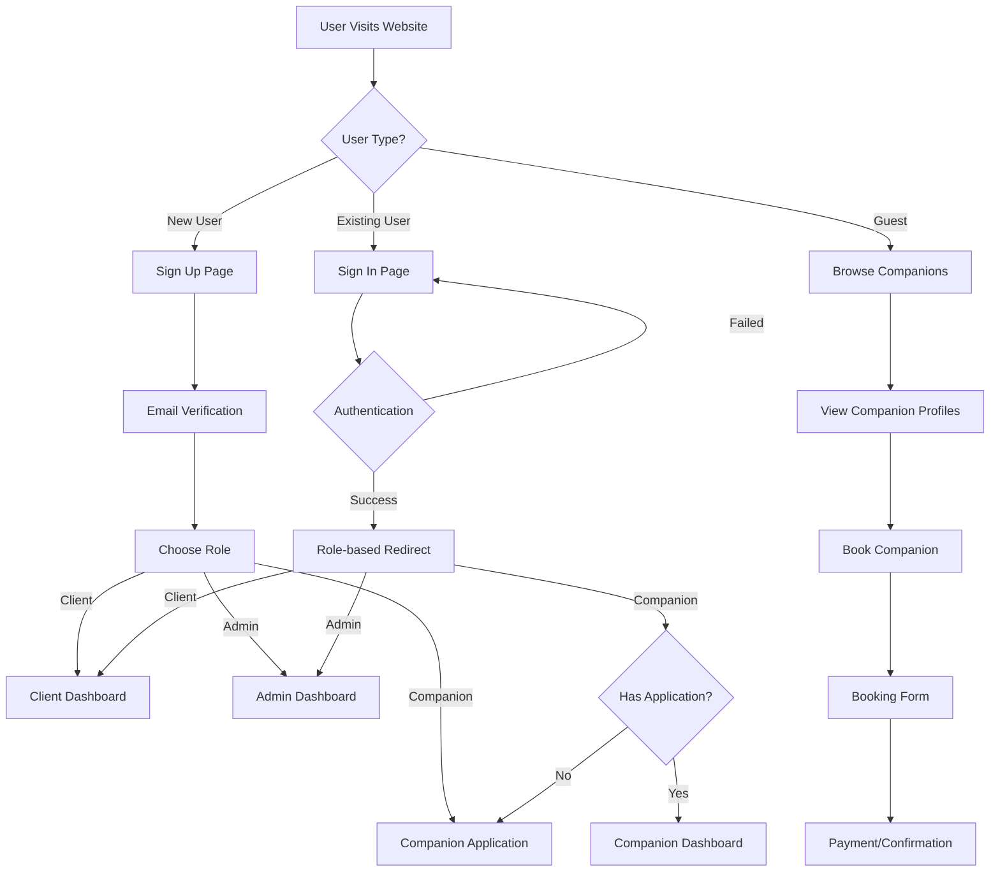

---

## 👤 2. Client User Journey Flow

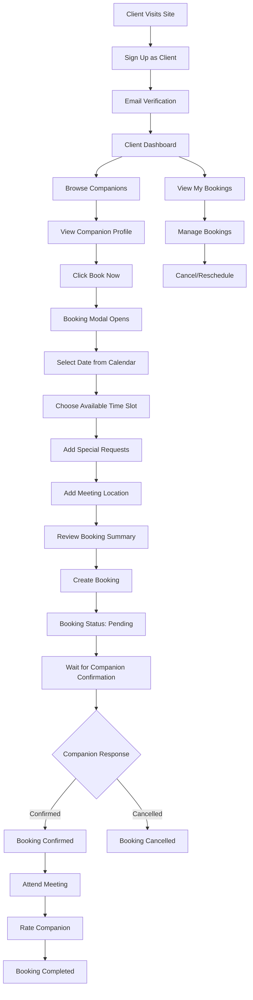

---

## 🎭 3. Companion User Journey Flow

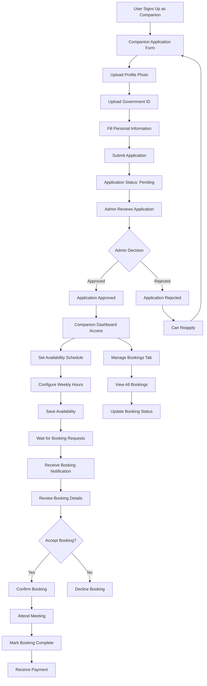

---

## 👑 4. Admin User Journey Flow

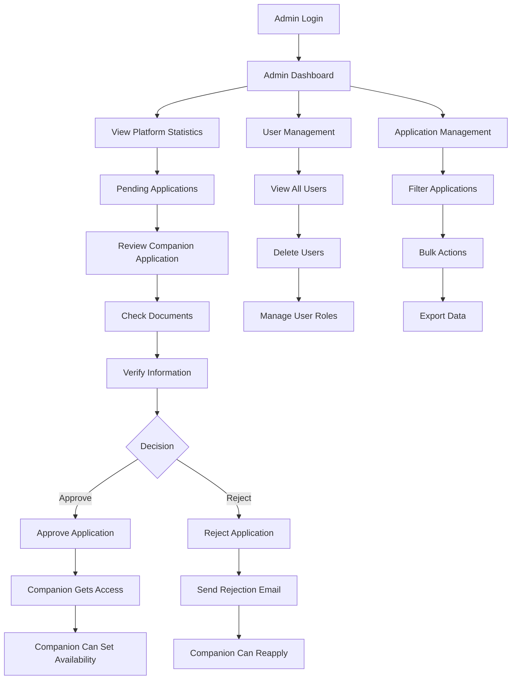

---

## 📅 5. Booking System Flow

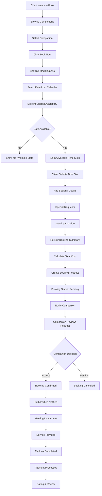

---

## 🗄️ 6. Database Interaction Flow

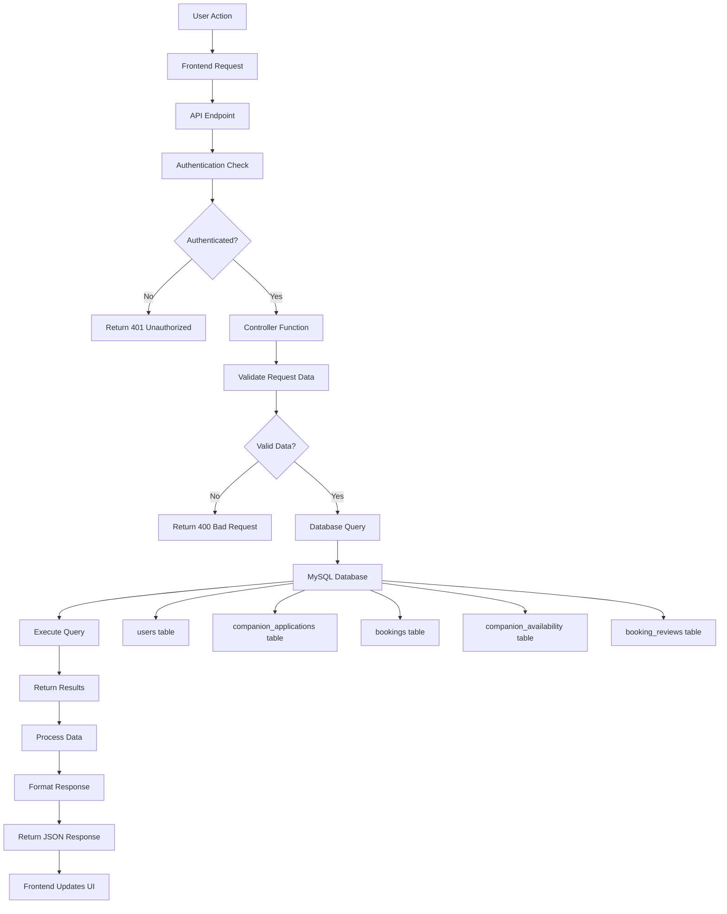

---

## 🔐 7. Authentication Flow

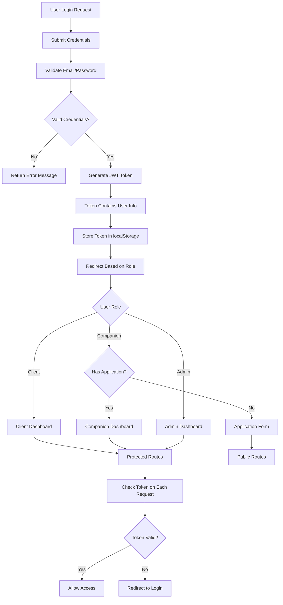

---

## 📱 8. Frontend Component Flow

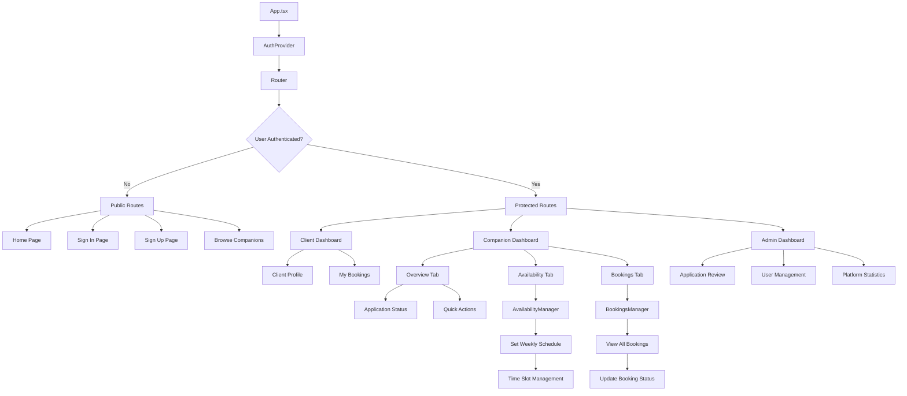

---

## 🔄 9. File Upload Flow

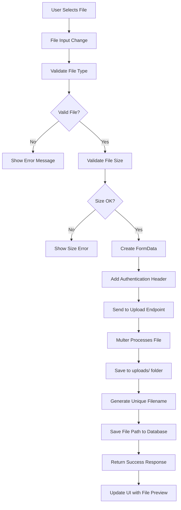

---

## 📧 10. Email Notification Flow

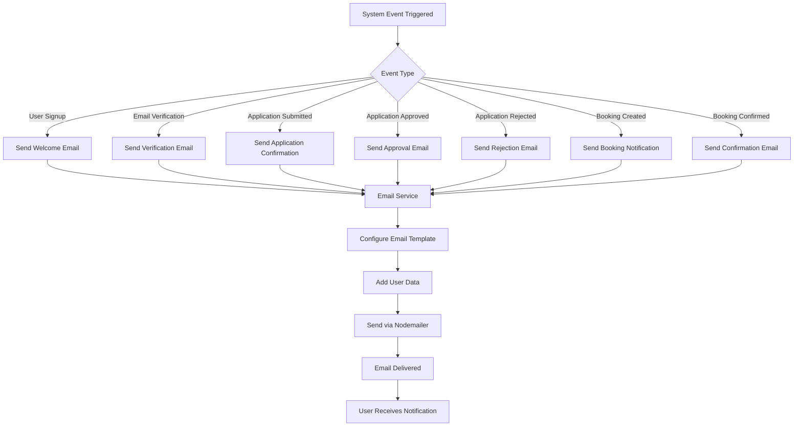

---

## 🎯 11. Complete Booking Process Flow

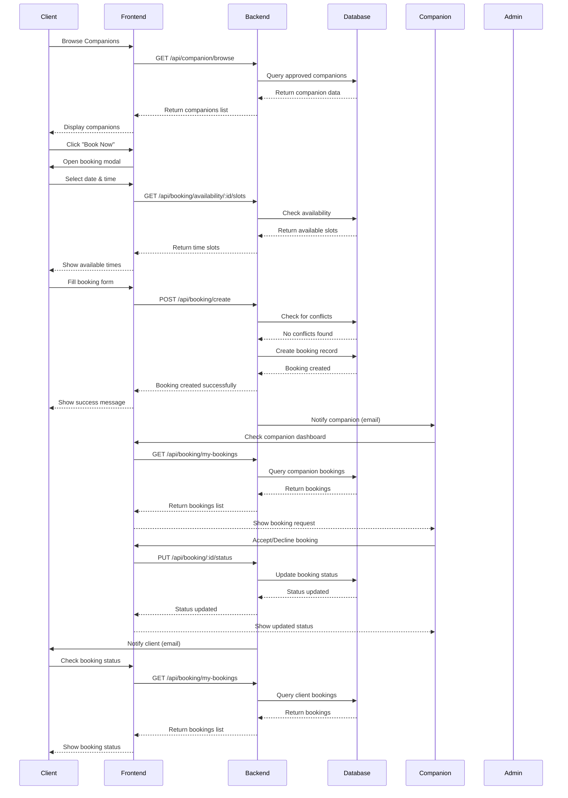

---

## 📊 12. System Status Flow

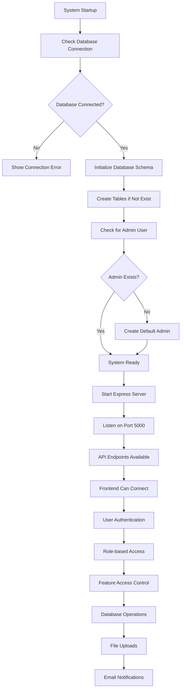

---

## 🎨 13. UI Component Hierarchy

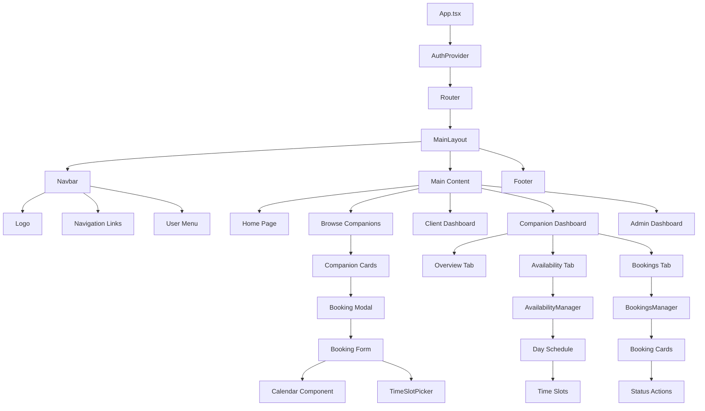

---

## 🔧 14. Error Handling Flow

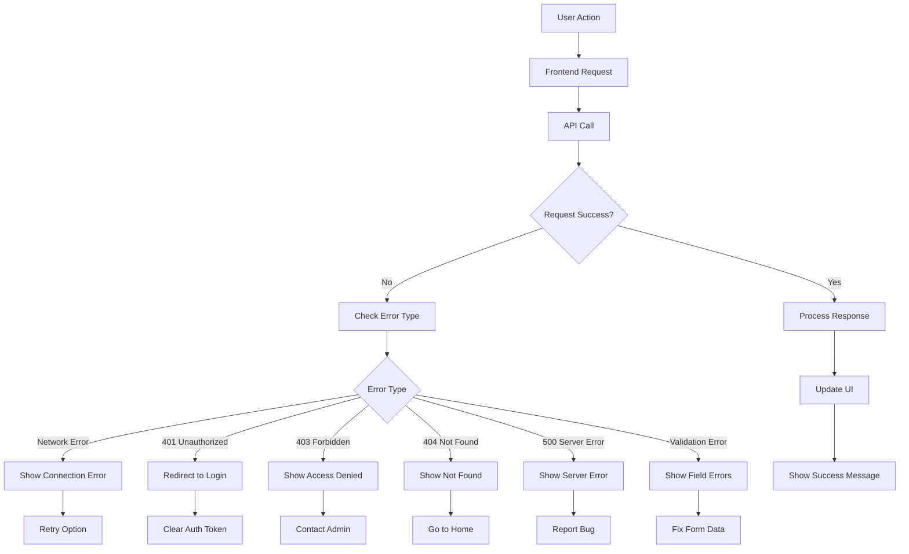

---

## 📈 15. Data Flow Summary

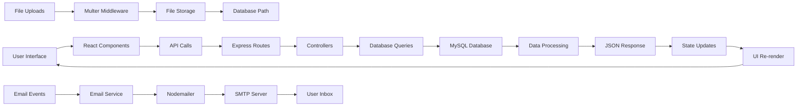

---

These flow diagrams provide a comprehensive visual representation of how the MeetGo platform works, from user interactions to system processes. Each diagram shows the step-by-step flow of different aspects of the platform, making it easy to understand the complete system architecture and user journeys.
